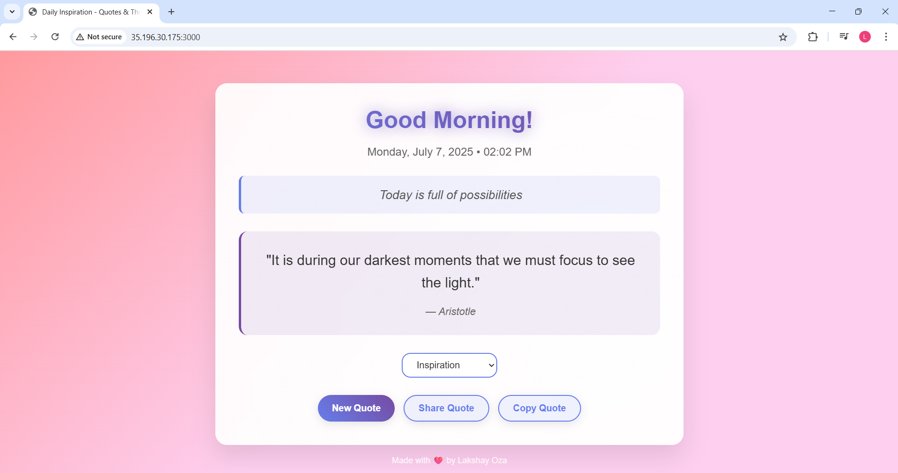

# 🚀 Quote-genetator on GCE

This project shows how to deploy a Node.js web app on a Google Cloud Compute Engine virtual machine (GCE). You’ll expose it to the internet over **HTTP** with firewall.


## 🧰 What You Need

- A Google Cloud account
- `gcloud` CLI set up

Step 1: Create a Compute Engine VM

<pre><code>gcloud compute instances create nodejs-instance \
  --zone=us-central1-a \
  --machine-type=e2-micro \
  --image-family=debian-11 \
  --image-project=debian-cloud \
  --tags=nodejs-app </code></pre>

<h1>You can create compute engine using the terraform</h1>

Before that, note change the values in the terraform.tfvars with your respected project id and region.
<pre><code>cd terraform

terraform init

terraform plan

terraform apply --auto-approve</code></pre>

Delete the VM using <code>terraform destroy</code> command.

This will:


Next <code>SSH into the VM -> install git -> install node and npm -> git clone https://github.com/ozalakshay/quote-generator.git -> cd quote-generator -> npm express</code>

Start the app in the background on port 8080

Step 2: Allow HTTP Traffic for accessing the app on Port 3000
Open port 3000 to the public internet:

<pre><code>gcloud compute firewall-rules create allow-http-node \
  --allow=tcp:3000 \
  --target-tags=nodejs-app \
  --description="Allow HTTP traffic to Node.js app on port 3000"</code></pre>
  

Step 3: Access the App

Open this in your browser:

```http://<your-external-ip>:3000```

You will see output as :

